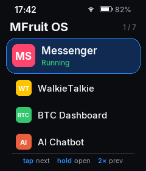
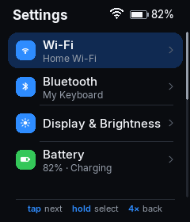
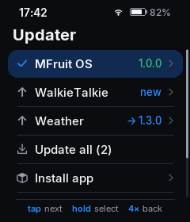
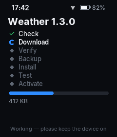

# MFruit OS

**A tiny operating system for [Whisplay](https://github.com/PiSugar/Whisplay) applications.**

MFruit OS turns a PiSugar Whisplay HAT on a Raspberry Pi Zero 2 W (or Orange
Pi Zero 2W / similar) into a small, polished device: it boots into a launcher,
installs and updates apps from GitHub with automatic rollback, and is used
entirely with the HAT's single button.

<p>





</p>

It runs **on top of `whisplay-daemon`**, not instead of it. The daemon keeps
owning the LCD, backlight, RGB LED, button and the foreground-app lifecycle;
MFruit OS is a daemon foreground app that draws into the daemon's shared
framebuffer. Every existing Whisplay app keeps working unchanged.

```
┌─────────────────────────────┐
│ MFruit OS                   │  launcher · settings · app manager
│                             │  updater · diagnostics
└──────────────┬──────────────┘
               │ daemon API (/tmp/whisplay-daemon.sock)
┌──────────────▼──────────────┐
│ whisplay-daemon             │  LCD · button · LED · backlight · app lifecycle
└──────────────┬──────────────┘
┌──────────────▼──────────────┐
│ Whisplay HAT                │
└─────────────────────────────┘
```

## Features

- **Launcher** — apps discovered automatically from MFruit OS packages and the
  daemon registry (nothing hard-coded); status badges for running, update
  available and broken apps.
- **One-button navigation** — tap = next, double-click = previous,
  hold = open/select, four clicks = back. Configurable; the OS refuses
  mappings that would lock you out.
- **App management** — enable, disable, hide, reorder, default app,
  autostart, stop, force stop, logs, uninstall.
- **Updater** — GitHub Releases as the app store: update, downgrade,
  reinstall, rollback, install new apps, discover apps by GitHub topic.
  Installs go through *check → download → verify → backup → install → test →
  activate*; a failure restores the previous version automatically.
- **Existing apps too** — apps installed as `git clone`s get commit-tracking
  updates (fast-forward only, rollback to the previous commit).
- **System** — system info, diagnostics with hardware tests (display, button,
  LED, speaker), display/LED/button/audio settings, daemon WiFi / Bluetooth /
  Volume / Power pages.
- **Robust** — a crashing app never takes the launcher down; the launcher
  re-takes the screen after apps exit, survives daemon restarts, has a
  systemd watchdog, and a failed OS update is rolled back at the next boot.
- **Offline first** — only the Updater needs the internet.
- **Light** — Python standard library + Pillow (already required by the
  daemon), no web server, no numpy. Measured on an Orange Pi Zero 2W: 35 MB RSS,
  0.01 % CPU while an app is in front; at Home it only redraws when something
  changes (about once a minute for the clock).

## Quick start

On the device, with [Whisplay and whisplay-daemon installed](https://github.com/PiSugar/Whisplay):

```bash
git clone https://github.com/Mengkungkao/MFruitOS.git
cd MFruitOS
bash scripts/install.sh
systemctl status whisplay-os
```

See [INSTALL.md](INSTALL.md) for details, updating and uninstalling.

## Using it

| Gesture (default) | Action |
|---|---|
| tap | next item |
| double-click | previous item |
| hold (0.7 s) | open / select |
| four quick clicks | back (inside apps: the daemon's exit gesture) |

Every screen shows its gestures in the footer and ends with a **Back** row.
Inside an app, four quick clicks ask the app to exit (the daemon's standard
behaviour); MFruit OS then takes the screen back.

From a shell (`ssh` to the device):

```bash
mfruitctl status                              # launcher state
mfruitctl apps                                # installed apps
mfruitctl install github.com/user/whisplay-weather
mfruitctl sideload ~/my-app                   # local package or folder
mfruitctl screenshot /tmp/screen.png          # what the LCD shows
mfruitctl help
```

## Building apps

Any Whisplay daemon app works. To make it installable and updatable through
MFruit OS, add a `manifest.json` and publish GitHub releases. Start from
[`templates/whisplay-app-template`](templates/whisplay-app-template) and read
[APP_DEVELOPMENT.md](APP_DEVELOPMENT.md).

```json
{
  "id": "weather",
  "name": "Weather",
  "version": "1.0.0",
  "description": "Weather information",
  "entrypoint": "run.sh",
  "icon": "assets/icon.png",
  "min_os_version": "1.0.0",
  "repository": "https://github.com/example/whisplay-weather"
}
```

## Files on the device

```
~/.whisplay-os/
├── apps/<id>/      installed packages (versions/, current -> active version, data/)
├── bin/            mfruit-run, mfruitctl, boot-guard.sh
├── cache/          GitHub metadata, downloads
├── config/settings.json
├── logs/           launcher.log, updater.log, <app>.log
├── state/          run state, control socket
└── system/         MFruit OS itself (versions/, current)
```

MFruit OS reads `~/.whisplay-daemon/app/` to discover daemon apps and only
changes daemon registrations through the daemon's own `app.register` API.

## Project layout

```
mfruitos/
├── daemon/       client.py (the only socket code), events.py, framebuffer.py
├── launcher/     runtime, focus state machine, event loop, gestures, UI, screens
├── apps/         manifest validation, registry
├── updater/      github.py, version.py, verifier.py, installer.py, rollback.py, gittrack.py
└── system/       settings.py, hardware.py, diagnostics.py, system_info.py
scripts/          install.sh, uninstall.sh, update.sh, deploy.sh, mfruit-run, boot-guard.sh
templates/        whisplay-app-template
tests/            unit + integration tests (fake daemon, end-to-end runtime)
docs/             ARCHITECTURE.md, screenshots
```

Run the tests with `python3 -m unittest discover -s tests` and preview every
screen without hardware with `python3 -m mfruitos --preview /tmp/screens`.

## Documentation

- [INSTALL.md](INSTALL.md) — installation, service, updating, uninstalling, troubleshooting
- [APP_DEVELOPMENT.md](APP_DEVELOPMENT.md) — app package format and lifecycle
- [docs/ARCHITECTURE.md](docs/ARCHITECTURE.md) — how MFruit OS works with the daemon
- [CONTRIBUTING.md](CONTRIBUTING.md) — development workflow
- [CHANGELOG.md](CHANGELOG.md)

## License

MIT — see [LICENSE](LICENSE). The bundled Inter font is under the SIL Open Font License.
# MFruitOS
